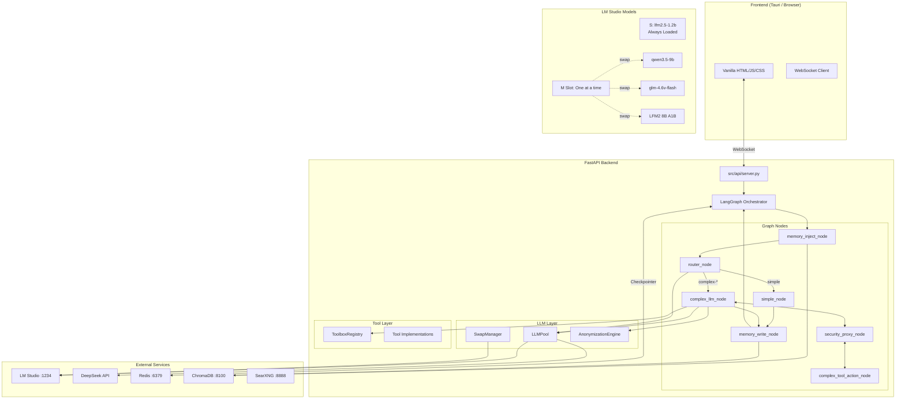
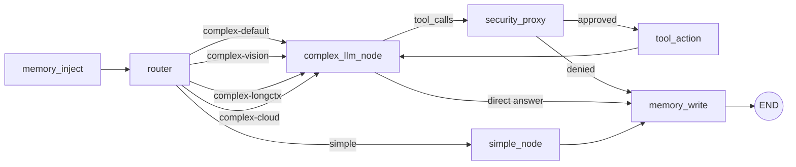
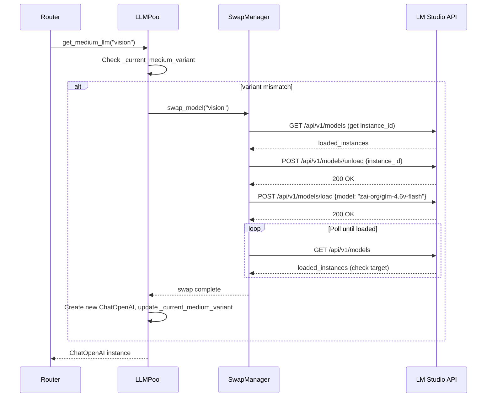

# Design Document: DeepSeek Hybrid Integration

## Overview

This design transforms Owlynn from a dual-LLM (small + large local) architecture into a three-tier S / M(swap) / L hybrid system. The core constraint is the Mac M4 Air 24GB unified memory: only the S model + one M-tier model + embeddings can be resident simultaneously.

The three tiers are:
- **S (Small):** `liquid/lfm2.5-1.2b` — always loaded, handles routing, simple answers, chat titles, toolbox selection, and HITL clarification
- **M (Medium):** Swappable local slot via LM Studio native API, hot-swaps between three variants:
  - `qwen/qwen3.5-9b` (DEFAULT) — general complex reasoning, tool calling
  - `zai-org/glm-4.6v-flash` (VISION) — image/multimodal processing
  - `LFM2 8B A1B GGUF Q8_0` (LONG CONTEXT) — extended context tasks
- **L (Large):** `deepseek-chat` via DeepSeek API (cloud) — frontier-quality reasoning, only when local models can't handle it

Key cross-cutting concerns:
1. **Dynamic Tool Loading** — Router selects toolbox categories; only relevant tools bound per turn (~2000 token savings)
2. **Data Anonymization** — PII scrubbing before cloud API calls, de-anonymization on response
3. **Redis STM** — Conversation history persists across model swaps and restarts via `langgraph-checkpoint-redis`
4. **Router HITL** — `ask_user` interrupt when routing confidence is low
5. **Cost Awareness** — Cloud token usage tracking per-message and cumulatively

## Architecture

### System Architecture Diagram



### Graph Flow (Updated 5-Way Routing)



### Model Swap Sequence



## Components and Interfaces

### 1. LLMPool (`src/agent/llm.py`)

Refactored from 2 slots (small + large) to 3 slots (small + medium + cloud).

```python
class LLMPool:
    _small_llm: Optional[ChatOpenAI] = None
    _medium_llm: Optional[ChatOpenAI] = None
    _cloud_llm: Optional[ChatOpenAI] = None
    _current_medium_variant: Optional[str] = None  # "default" | "vision" | "longctx"
    _lock = asyncio.Lock()

    @classmethod
    async def get_small_llm(cls) -> ChatOpenAI: ...

    @classmethod
    async def get_medium_llm(cls, variant: str = "default") -> ChatOpenAI:
        """
        Returns cached instance if variant matches, otherwise triggers swap.
        variant: "default" | "vision" | "longctx"
        Raises ModelSwapError if swap fails.
        """
        ...

    @classmethod
    async def get_cloud_llm(cls) -> ChatOpenAI:
        """
        Returns DeepSeek API client.
        Raises CloudUnavailableError if no API key configured.
        """
        ...

    @classmethod
    def clear(cls): ...
```

**Design decisions:**
- Cloud LLM uses `streaming=True`, `max_tokens=8192`, `temperature=0.4`, no `extra_body` (DeepSeek API incompatibility)
- API key resolution: `DEEPSEEK_API_KEY` env var → `deepseek_api_key` in User_Profile → disabled
- The `get_large_llm()` function is kept as an alias for `get_medium_llm("default")` for backward compatibility during migration

### 2. SwapManager (`src/agent/swap_manager.py`) — NEW

Wraps LM Studio native API for model load/unload. Uses `httpx.AsyncClient`.

```python
class ModelSwapError(Exception): ...

class SwapManager:
    def __init__(self, base_url: str = "http://127.0.0.1:1234"):
        self._base_url = base_url
        self._current_variant: Optional[str] = None
        self._client = httpx.AsyncClient()

    async def swap_model(self, target_variant: str) -> None:
        """Unload current M-tier model, load target. Raises ModelSwapError on failure."""
        ...

    def get_current_variant(self) -> Optional[str]: ...

    async def get_loaded_instance_ids(self, model_key: str) -> list[str]: ...
```

**Design decisions:**
- Unload-then-load sequence (not parallel) to respect VRAM constraint
- Poll interval: 2 seconds, timeout: 120 seconds (configurable)
- If unload fails, proceed with load anyway (LM Studio may handle conflict)
- Model key mapping read from `User_Profile["medium_models"]`

### 3. Router (`src/agent/nodes/router.py`)

Extended from 2-way (simple/complex) to 5-way routing with toolbox selection.

**Updated Router Prompt (JSON output):**
```json
{
  "routing": "simple" | "complex",
  "confidence": 0.0-1.0,
  "toolbox": "web_search" | "file_ops" | "data_viz" | "productivity" | "memory" | "all" | ["toolbox1", "toolbox2"],
  "needs_clarification": true | false
}
```

**Two-stage decision for complex routes:**
1. Stage 1: simple vs complex (existing keyword heuristics + Small_LLM)
2. Stage 2 (complex only): select variant
   - Image attachments → `complex-vision`
   - Input tokens > 80% of Medium_Default context → `complex-longctx`
   - Input tokens > Medium_LongCtx context OR frontier-quality indicators → `complex-cloud`
   - Default → `complex-default`
   - Prefer currently-loaded variant when borderline (avoid swap latency)

**HITL Clarification:**
- When `confidence < router_clarification_threshold` (default 0.6) and `router_hitl_enabled` is true
- Uses `interrupt()` with selectable choices mapping to routes/toolboxes
- Single question per turn, no re-invocation of Small_LLM after clarification

### 4. ToolboxRegistry (`src/agent/tool_sets.py`)

New dictionary-based registry alongside existing flat lists.

```python
TOOLBOX_REGISTRY: dict[str, list] = {
    "web_search": [web_search, fetch_webpage],
    "file_ops": [read_workspace_file, write_workspace_file, edit_workspace_file,
                 list_workspace_files, delete_workspace_file],
    "data_viz": [create_docx, create_xlsx, create_pptx, create_pdf,
                 notebook_run, notebook_reset],
    "productivity": [todo_add, todo_list, todo_complete, list_skills, invoke_skill],
    "memory": [recall_memories],
}

ALWAYS_INCLUDED_TOOLS: list = [ask_user]

def resolve_tools(toolbox_names: list[str], web_search_enabled: bool = True) -> list:
    """Union of requested toolboxes + always-included. 'all' = full set."""
    ...
```

### 5. AnonymizationEngine (`src/agent/anonymization.py`) — NEW

PII scrubbing for cloud-bound messages.

```python
def anonymize(text: str, context: dict) -> tuple[str, dict]:
    """
    Scan text for sensitive patterns, replace with [CATEGORY_N] placeholders.
    context: {"name": "Tim", "custom_terms": ["secret-project"], ...}
    Returns (anonymized_text, mapping).
    """
    ...

def deanonymize(text: str, mapping: dict) -> str:
    """Restore placeholders to original values."""
    ...
```

**Detection categories (priority order — longest match first):**
1. API keys/tokens (`sk-`, `key-`, `Bearer`, `ghp_`, 32+ char alphanumeric)
2. Email addresses
3. URLs with localhost ports
4. File system paths (`/Users/`, `/home/`, `C:\`, `~/`)
5. IP addresses (excluding `0.0.0.0`, `255.255.255.255`)
6. Phone numbers (international formats)
7. Known names (from User_Profile `name` field)
8. Custom sensitive terms (from User_Profile `custom_sensitive_terms`)

**Round-trip property:** `deanonymize(anonymize(text, ctx)[0], anonymize(text, ctx)[1]) == text`

### 6. Complex Node (`src/agent/nodes/complex.py`)

Updated to:
- Read `route` from Agent_State to select model via LLMPool
- Use `resolve_tools()` from ToolboxRegistry based on `selected_toolboxes`
- Apply anonymization for `complex-cloud` route only
- Apply LM_Studio_Compat folding for local models, standard OpenAI format for cloud
- Implement tiered fallback: cloud → medium-default, vision → medium-default, longctx → cloud → medium-default

### 7. LM Studio Compat (`src/agent/lm_studio_compat.py`)

New helper function:
```python
def is_local_server(base_url: str) -> bool:
    """True if base_url points to localhost/127.0.0.1."""
    ...
```

Complex_Node uses this to decide message format: folded for local, standard for cloud.

### 8. Redis Checkpointer (`src/agent/graph.py`)

```python
from langgraph_checkpoint_redis import AsyncRedisSaver

async def init_agent(checkpointer=None):
    if checkpointer is None:
        try:
            checkpointer = AsyncRedisSaver(url=REDIS_URL)
            await checkpointer.setup()
        except Exception:
            logger.warning("Redis unavailable, falling back to MemorySaver")
            checkpointer = MemorySaver()
    ...
```

### 9. Server Updates (`src/api/server.py`)

- New `GET /api/usage` endpoint returning cumulative session token usage
- WebSocket messages include `model_used` and `token_usage` fields
- WebSocket sends `model_info` events with `swapping` flag during M-tier swaps
- Profile save endpoint triggers `LLMPool.clear()` when cloud/medium fields change

### 10. Frontend Updates (`frontend/`)

- Settings Profile tab: Medium Models section (3 fields) + Cloud section (URL, model, masked API key)
- Settings Advanced tab: Cloud escalation toggle, anonymization toggle, HITL toggle, threshold slider, custom sensitive terms textarea
- Settings Memory tab: Redis URL field
- Model badges: tier-colored (gray=small, blue=medium, purple=cloud, orange=fallback)
- Cloud token indicator: `↑{prompt} ↓{completion}` next to badge
- Swap indicator: transient "Switching to vision model..." message
- Router clarification: choices rendered as clickable buttons via existing `handleAskUserInterrupt`

## Data Models

### Agent State (Updated)

```python
class AgentState(TypedDict):
    messages: Annotated[Sequence[BaseMessage], add_messages]
    current_task: str | None
    extracted_facts: Annotated[list[str], operator.add]
    long_term_context: str | None
    mode: str | None
    web_search_enabled: bool | None
    response_style: str | None
    project_id: str | None
    execution_approved: bool | None

    # Routing — expanded from 2-way to 5-way
    route: str | None  # "simple" | "complex-default" | "complex-vision" | "complex-longctx" | "complex-cloud"
    model_used: str | None  # "small-local" | "medium-default" | "medium-vision" | "medium-longctx" | "large-cloud" | "*-fallback"
    current_medium_model: str | None  # "default" | "vision" | "longctx" | None

    # Dynamic tool loading
    selected_toolboxes: list[str] | None  # ["web_search", "file_ops"] or ["all"]

    # Memory & persona
    memory_context: str | None
    persona: str | None
    token_budget: int | None

    # Security
    pending_tool_calls: bool | None
    pending_tool_names: Annotated[list[str], operator.add]
    security_decision: str | None
    security_reason: str | None

    # Cloud cost tracking
    api_tokens_used: dict | None  # {"prompt_tokens": int, "completion_tokens": int}

    # Router HITL
    router_clarification_used: bool | None
```

### User Profile (Updated `data/user_profile.json`)

New fields added to existing profile:

```json
{
  "cloud_llm_base_url": "https://api.deepseek.com/v1",
  "cloud_llm_model_name": "deepseek-chat",
  "deepseek_api_key": "",
  "medium_models": {
    "default": "qwen/qwen3.5-9b",
    "vision": "zai-org/glm-4.6v-flash",
    "longctx": "LFM2 8B A1B GGUF Q8_0"
  },
  "cloud_escalation_enabled": true,
  "cloud_anonymization_enabled": true,
  "custom_sensitive_terms": [],
  "router_hitl_enabled": true,
  "router_clarification_threshold": 0.6,
  "redis_url": "redis://localhost:6379"
}
```

Removed fields: `large_llm_base_url`, `large_llm_model_name` (replaced by `medium_models`)

### Settings Module Updates (`src/config/settings.py`)

```python
# New constants
REDIS_URL = os.getenv("REDIS_URL", "redis://localhost:6379")
DEEPSEEK_API_KEY = os.getenv("DEEPSEEK_API_KEY", "")

# Context windows per tier
MEDIUM_DEFAULT_CONTEXT = 100000
MEDIUM_LONGCTX_CONTEXT = int(os.getenv("MEDIUM_LONGCTX_CONTEXT", "131072"))
CLOUD_CONTEXT = 131072

# M4 optimization additions
M4_MAC_OPTIMIZATION["large_model"]["cloud_timeout"] = 180
M4_MAC_OPTIMIZATION["medium_models"] = {
    "swap_timeout": 120,
    "poll_interval": 2,
}
```

### Docker Compose (Updated)

```yaml
services:
  redis:
    image: redis:7-alpine
    container_name: cowork_redis
    ports:
      - "6379:6379"
    volumes:
      - redis_data:/data
    command: redis-server --appendonly yes
    restart: unless-stopped
    mem_limit: 512m

volumes:
  redis_data:
```

### WebSocket Message Schema Updates

```json
// AI response message (existing + new fields)
{
  "type": "message",
  "content": "...",
  "model_used": "medium-default",
  "token_usage": {
    "prompt_tokens": 1234,
    "completion_tokens": 567
  }
}

// Model info event (new)
{
  "type": "model_info",
  "model": "medium-vision",
  "swapping": true
}

// Usage endpoint response
// GET /api/usage
{
  "prompt_tokens": 5000,
  "completion_tokens": 2000,
  "total_tokens": 7000,
  "session_id": "..."
}
```

### Anonymization Mapping (Per-Request, In-Memory Only)

```python
# Example mapping for a single cloud request
{
    "[NAME_1]": "Tim",
    "[EMAIL_1]": "[email]",
    "[PATH_1]": "/Users/tim/projects/owlynn",
    "[API_KEY_1]": "sk-abc123...",
    "[CUSTOM_1]": "secret-project"
}
```

### File Changes Summary

| File | Change Type | Description |
|------|-------------|-------------|
| `src/agent/llm.py` | Modify | 3-slot LLMPool (small + medium + cloud), variant tracking |
| `src/agent/swap_manager.py` | New | SwapManager wrapping LM Studio native API |
| `src/agent/anonymization.py` | New | AnonymizationEngine with anonymize/deanonymize |
| `src/agent/nodes/router.py` | Modify | 5-way routing, toolbox selection, HITL clarification |
| `src/agent/nodes/complex.py` | Modify | Model selection by route, dynamic tool binding, anonymization, fallback chain |
| `src/agent/nodes/simple.py` | Modify | Set `model_used` to `"small-local"` |
| `src/agent/tool_sets.py` | Modify | Add TOOLBOX_REGISTRY, resolve_tools() |
| `src/agent/state.py` | Modify | New fields: current_medium_model, selected_toolboxes, api_tokens_used, router_clarification_used |
| `src/agent/graph.py` | Modify | 5-way route_decision, Redis checkpointer, updated init_agent |
| `src/agent/lm_studio_compat.py` | Modify | Add is_local_server() |
| `src/config/settings.py` | Modify | REDIS_URL, context window constants, cloud_timeout |
| `src/memory/user_profile.py` | Modify | New profile fields and defaults |
| `src/api/server.py` | Modify | /api/usage endpoint, model_info WS events, swap indicator |
| `docker-compose.yml` | Modify | Add Redis service |
| `requirements.txt` | Modify | Add langgraph-checkpoint-redis, httpx |
| `setup.sh` | Modify | Podman memory config, Redis container |
| `start.sh` | Modify | Redis container check, connectivity verification |
| `frontend/index.html` | Modify | Settings panel updates (medium models, cloud, advanced toggles) |
| `frontend/script.js` | Modify | Model badges, token indicators, swap indicator, HITL choices |
| `frontend/style.css` | Modify | Tier-colored badge styles |
| `data/user_profile.json` | Modify | New default fields |
| `tests/test_graph.py` | Modify | 5-way routing tests, Redis mock |
| `tests/test_router_web_intent.py` | Modify | Toolbox selection, vision, cloud tests |
| `tests/test_swap_manager.py` | New | SwapManager unit tests |
| `tests/test_anonymization.py` | New | Anonymization round-trip and pattern tests |
| `tests/test_toolbox_registry.py` | New | resolve_tools tests |
| `tests/test_llm_pool.py` | New | LLMPool variant tracking tests |
| `tests/test_conversation_continuity.py` | New | Cross-swap message preservation |
| `tests/standalone/test_redis_checkpointer.py` | New | Live Redis integration test |
| `docs/ARCHITECTURE_OVERVIEW.md` | Modify | S/M/L architecture, swap manager, toolbox, anonymization |
| `docs/guides/quickstart.md` | Modify | DeepSeek key setup, Redis setup |
| `docs/guides/lm_studio.md` | Modify | Three M-tier variants |
| `docs/guides/m4_deployment.md` | Modify | Podman memory, VRAM budget |
| `docs/API_REFERENCE.md` | Modify | /api/usage, new profile fields |
| `docs/TOOLS.md` | Modify | Toolbox categories |


## Correctness Properties

*A property is a characteristic or behavior that should hold true across all valid executions of a system — essentially, a formal statement about what the system should do. Properties serve as the bridge between human-readable specifications and machine-verifiable correctness guarantees.*

### Property 1: Anonymization Round-Trip

*For any* text string and any valid anonymization context (containing a name and custom terms), anonymizing the text and then de-anonymizing the result with the returned mapping SHALL produce the original text. Additionally, all placeholders in the anonymized text SHALL match the `[CATEGORY_N]` format, and repeated occurrences of the same sensitive value SHALL map to the same placeholder.

**Validates: Requirements 19.3, 19.4, 19.7**

### Property 2: Route Decision Domain

*For any* user message (with or without image attachments, of any token length), the Router SHALL produce a `route` value that is exactly one of: `"simple"`, `"complex-default"`, `"complex-vision"`, `"complex-longctx"`, or `"complex-cloud"`. Furthermore:
- Messages with `image_url` content blocks SHALL route to `"complex-vision"`
- Messages whose estimated token count exceeds 80% of `MEDIUM_DEFAULT_CONTEXT` (but fits `MEDIUM_LONGCTX_CONTEXT`) SHALL route to `"complex-longctx"`
- Messages whose estimated token count exceeds `MEDIUM_LONGCTX_CONTEXT` SHALL route to `"complex-cloud"`
- All other complex messages SHALL route to `"complex-default"`

**Validates: Requirements 4.1, 4.3, 4.4, 4.5, 4.6**

### Property 3: LLMPool Variant Tracking

*For any* sequence of `get_medium_llm(variant)` calls with variant values drawn from `{"default", "vision", "longctx"}`, the LLMPool's `_current_medium_variant` field SHALL always equal the variant of the most recent successful call. When the requested variant matches `_current_medium_variant`, no swap SHALL be triggered. When it differs, a swap SHALL be triggered. After `clear()`, `_current_medium_variant` SHALL be `None`.

**Validates: Requirements 2.2, 2.4, 2.5, 2.9**

### Property 4: Token Budget Uses Correct Context Window

*For any* route decision, the token budget SHALL be computed using the context window constant corresponding to that route:
- `complex-default` → `MEDIUM_DEFAULT_CONTEXT` (100000) with input reserve 4000
- `complex-longctx` → `MEDIUM_LONGCTX_CONTEXT` (131072) with input reserve 4000
- `complex-cloud` → `CLOUD_CONTEXT` (131072) with input reserve 8000
- `simple` → `SMALL_MODEL_CONTEXT` (4096) with input reserve 1500

**Validates: Requirements 5.1, 5.2, 5.3, 5.4, 5.5, 5.6, 5.7, 5.8**

### Property 5: Resolve Tools Produces Correct Union

*For any* subset of valid toolbox names (`"web_search"`, `"file_ops"`, `"data_viz"`, `"productivity"`, `"memory"`) and any boolean `web_search_enabled` value, `resolve_tools(names, web_search_enabled)` SHALL return a list containing exactly the union of tools from the requested toolboxes plus `ask_user`. When `"all"` is in the names, the full tool set SHALL be returned. When `web_search_enabled` is `False`, `web_search` and `fetch_webpage` SHALL be excluded regardless of requested toolboxes.

**Validates: Requirements 15.7, 15.8, 15.9, 15.10**

### Property 6: is_local_server Classification

*For any* URL string, `is_local_server(url)` SHALL return `True` if and only if the URL contains `"127.0.0.1"` or `"localhost"`. All other URLs (including cloud API endpoints like `https://api.deepseek.com/v1`) SHALL return `False`.

**Validates: Requirements 9.1, 9.3**

### Property 7: Model Provenance Matches Route

*For any* route value processed by the Complex_Node, the `model_used` field in the returned Agent_State SHALL correspond to the route:
- `complex-default` → `"medium-default"`
- `complex-vision` → `"medium-vision"`
- `complex-longctx` → `"medium-longctx"`
- `complex-cloud` → `"large-cloud"`
- `simple` → `"small-local"`

When a fallback occurs, `model_used` SHALL contain `"-fallback"` suffix.

**Validates: Requirements 11.1, 11.2, 11.3, 11.4, 11.5, 11.6**

### Property 8: Cloud-Only Anonymization

*For any* route value and any `cloud_anonymization_enabled` setting, the Complex_Node SHALL invoke the Anonymization_Engine if and only if the route is `"complex-cloud"` AND `cloud_anonymization_enabled` is `True`. For all local routes (`complex-default`, `complex-vision`, `complex-longctx`, `simple`), messages SHALL be sent without anonymization regardless of the toggle setting.

**Validates: Requirements 21.1, 21.7, 23.2**

### Property 9: Swap Manager Variant-to-Key Mapping

*For any* valid variant name (`"default"`, `"vision"`, `"longctx"`), the Swap_Manager SHALL use the model key from `User_Profile["medium_models"][variant]` when calling the LM Studio load API. The mapping SHALL be: `"default"` → `medium_models.default`, `"vision"` → `medium_models.vision`, `"longctx"` → `medium_models.longctx`.

**Validates: Requirements 3.1**

### Property 10: API Key Resolution Order

*For any* combination of `DEEPSEEK_API_KEY` environment variable and `deepseek_api_key` User_Profile field, the LLMPool SHALL resolve the API key by checking the environment variable first. If the environment variable is set and non-empty, it SHALL be used. Otherwise, the User_Profile field SHALL be used. If neither is set, cloud escalation SHALL be disabled.

**Validates: Requirements 1.1, 1.2**

### Property 11: Redis Checkpoint Round-Trip

*For any* valid Agent_State and Thread_ID, storing the state via the Redis_Checkpointer and then retrieving it for the same Thread_ID SHALL produce an Agent_State with identical `messages`, `route`, `model_used`, `selected_toolboxes`, and `token_budget` fields. Different Thread_IDs SHALL maintain isolated state.

**Validates: Requirements 25.7, 25.8, 25.9**

### Property 12: Conversation Continuity Across Swaps

*For any* conversation thread where multiple turns are handled by different model variants (e.g., turn 1 by `medium-default`, turn 2 by `medium-vision`, turn 3 by `medium-default`), the `messages` list in Agent_State SHALL contain all messages from all turns in order, and each turn's `model_used` provenance SHALL be preserved in the checkpointed state.

**Validates: Requirements 26.1, 26.5**

### Property 13: Model Badge Color Mapping

*For any* `model_used` string, the frontend badge color SHALL be determined by the prefix:
- Starts with `"small"` → gray (`#374151` bg)
- Starts with `"medium"` → blue (`#1e3a5f` bg)
- Starts with `"large"` → purple (`#2b2646` bg)
- Contains `"fallback"` → orange (`#451a03` bg)

**Validates: Requirements 30.10, 30.11, 30.12, 30.13**

### Property 14: Sensitive Pattern Detection Coverage

*For any* text containing an email address, phone number, file system path, API key pattern, or IP address, the Anonymization_Engine SHALL detect and replace it with a placeholder. Longer matches SHALL be processed before shorter ones to prevent partial replacements (e.g., an email SHALL be matched as `[EMAIL_N]` rather than having the name portion matched as `[NAME_N]`).

**Validates: Requirements 20.2, 20.3, 20.4, 20.5, 20.6, 20.9**

### Property 15: Router HITL Threshold Behavior

*For any* Router confidence score and any `router_clarification_threshold` value, the Router SHALL trigger a clarification question (via `interrupt()`) if and only if the confidence is strictly below the threshold AND `router_hitl_enabled` is `True`. When `router_hitl_enabled` is `False`, no clarification SHALL be triggered regardless of confidence.

**Validates: Requirements 24.1, 24.4, 24.7, 24.8**

## Error Handling

### Model Tier Fallback Chain

The system implements a tiered fallback strategy to ensure users always get a response:

1. **Cloud failure** → Retry once with Medium_Default. If Medium_Default also fails, return error message with suggestion to check API key (for 401/403) or retry.
2. **Medium_Vision failure** → Fall back to Medium_Default. Log warning.
3. **Medium_LongCtx failure** → Try Cloud_LLM first, then Medium_Default with truncated context. Log warning.
4. **Medium_Default failure** → Return error message suggesting user check LM Studio.
5. **Small_LLM failure** → Existing fallback to Medium_Default (unchanged from current behavior).
6. **Model swap failure (ModelSwapError)** → Use currently-loaded M-tier variant. Log warning.

All fallbacks set `model_used` to a descriptive value with `-fallback` suffix.

### Redis Checkpointer Failure

- If Redis is unreachable at startup → Fall back to `MemorySaver` with warning log
- If Redis becomes unreachable mid-session → LangGraph handles this internally; conversation continues but state may not persist across restarts

### Anonymization Edge Cases

- If anonymization fails (regex error, unexpected input) → Skip anonymization for that request, log warning, send unanonymized (fail-open for usability, fail-closed would block cloud entirely)
- If de-anonymization encounters unknown placeholders (model hallucinated `[NAME_99]`) → Leave placeholder unchanged in response text
- If cloud fallback to local model occurs after anonymization → Skip de-anonymization (local model received non-anonymized input)

### LM Studio API Failures

- Unload fails → Proceed with load attempt (LM Studio may handle conflict)
- Load fails or times out → Raise `ModelSwapError`, caught by Complex_Node for fallback
- LM Studio not running → All local model calls fail; error message suggests starting LM Studio

### DeepSeek API Specific Errors

- HTTP 401/403 → Append note to response about checking API key configuration
- HTTP 429 (rate limit) → Retry once after 2-second delay, then fall back to Medium_Default
- Network timeout → Fall back to Medium_Default (cloud_timeout: 180s)

## Testing Strategy

### Dual Testing Approach

The testing strategy uses both unit tests (specific examples, edge cases) and property-based tests (universal properties across generated inputs). Both are complementary:
- **Unit tests** catch concrete bugs with specific known inputs
- **Property tests** verify general correctness across randomized inputs

### Property-Based Testing Configuration

- **Library:** `hypothesis` (Python PBT library)
- **Minimum iterations:** 100 per property test
- **Tag format:** `# Feature: deepseek-hybrid-integration, Property {N}: {title}`
- Each correctness property from the design document maps to exactly one property-based test

### Test Modules

| Module | Type | What it tests |
|--------|------|---------------|
| `tests/test_anonymization.py` | Unit + PBT | Anonymization round-trip (Property 1), pattern detection (Property 14), placeholder format, edge cases |
| `tests/test_router_web_intent.py` | Unit + PBT | Route decision domain (Property 2), toolbox selection, vision detection, cloud escalation |
| `tests/test_llm_pool.py` | Unit + PBT | Variant tracking (Property 3), API key resolution (Property 10), cache behavior, clear() |
| `tests/test_toolbox_registry.py` | Unit + PBT | resolve_tools correctness (Property 5), all-toolbox fallback, web_search exclusion |
| `tests/test_graph.py` | Unit | Graph compilation with 5-way routing, Redis mock, route_decision mapping |
| `tests/test_swap_manager.py` | Unit | Swap sequence, variant-to-key mapping (Property 9), timeout, error handling |
| `tests/test_conversation_continuity.py` | Unit + PBT | Message preservation across swaps (Property 12), model_used provenance |
| `tests/test_sml_graph.py` | Unit | Renamed from test_small_large_graph.py, updated for S/M/L paths |
| `tests/standalone/test_redis_checkpointer.py` | Integration | Live Redis round-trip (Property 11), thread isolation |
| `tests/standalone/test_lm_studio_model_load_unload.py` | Integration | Existing test, unchanged |

### Property Test → Design Property Mapping

| Property Test | Design Property | Key Assertion |
|---------------|-----------------|---------------|
| `test_anonymize_deanonymize_roundtrip` | Property 1 | `deanonymize(anonymize(text, ctx)) == text` |
| `test_route_decision_domain` | Property 2 | Route ∈ {simple, complex-default, complex-vision, complex-longctx, complex-cloud} |
| `test_llmpool_variant_tracking` | Property 3 | `_current_medium_variant` always matches last successful call |
| `test_token_budget_context_window` | Property 4 | Budget computed with correct context constant per route |
| `test_resolve_tools_union` | Property 5 | Result = union(toolboxes) ∪ {ask_user} |
| `test_is_local_server` | Property 6 | True iff URL contains localhost/127.0.0.1 |
| `test_model_provenance_matches_route` | Property 7 | model_used corresponds to route |
| `test_cloud_only_anonymization` | Property 8 | Anonymization iff cloud route AND enabled |
| `test_swap_variant_to_key` | Property 9 | Correct model key per variant |
| `test_api_key_resolution_order` | Property 10 | Env var > profile > disabled |
| `test_redis_checkpoint_roundtrip` | Property 11 | Store then retrieve = identical state |
| `test_conversation_continuity` | Property 12 | All messages preserved across swaps |
| `test_badge_color_mapping` | Property 13 | Prefix → color mapping |
| `test_sensitive_pattern_detection` | Property 14 | All pattern categories detected, longest-first |
| `test_router_hitl_threshold` | Property 15 | Clarification iff confidence < threshold AND enabled |

### Unit Test Focus Areas

- **Edge cases:** Missing API key, Redis unavailable, LM Studio down, empty messages, malformed JSON from router
- **Error conditions:** ModelSwapError handling, HTTP 401/403/429 from DeepSeek, timeout scenarios
- **Integration points:** WebSocket model_info events, /api/usage endpoint, profile save → LLMPool.clear()
- **Backward compatibility:** Existing tests pass with new 5-way routing (old "complex" route maps to "complex-default")
