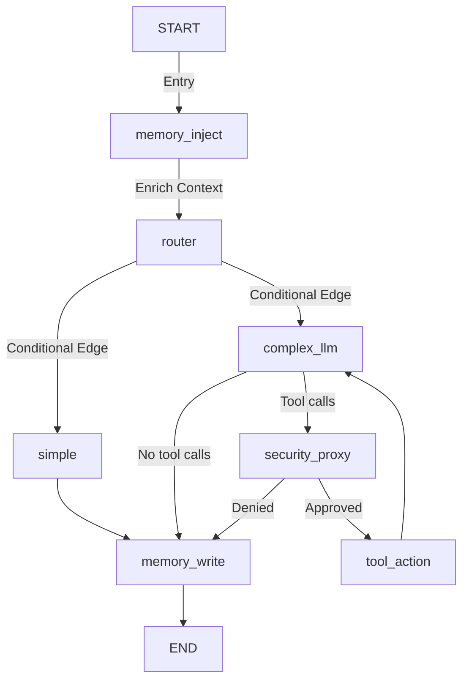

# Architecture Overview

Owlynn is a local-first autonomous agent built with **LangGraph** for orchestration and **FastAPI** for the backend, serving a single-page frontend. It is optimized for local inference (e.g., on Apple Silicon).

## Core Components

### 1. Orchestrator (LangGraph)
The core logic resides in `src/agent/graph.py`. It uses a stateful graph with a fast `simple` path and a secure cyclic `complex` path.

#### Execution Flow

*   **`memory_inject`**: Loads short-term and long-term context prior to reasoning.
*   **`router`**: Uses logic or a smaller model to determine if the query is **Simple** or **Complex**.
*   **`simple`**: Handles quick questions, chit-chat, or direct answers.
*   **`complex_llm`**: Handles multi-step reasoning and coding using the **large** model. When `mode` is `tools_on` (default), the model is invoked **with tools bound** (workspace read, sandbox Python, memory recall, and web tools when enabled). It may emit tool calls.
*   **`security_proxy`**: Mandatory gate before tool execution. Reviews/approves pending tool calls.
*   **`tool_action`**: Executes approved tool calls via `ToolNode`, then loops back to `complex_llm` for the next reasoning step.
*   **`response_style`**: Optional chat payload (`normal`, `learning`, `concise`, `explanatory`, `formal`) appends short system hints on both **simple** and **complex** paths.
*   **`memory_write`**: Persists new facts and updates state.

Note: the repo still contains `tool_selector` / `tool_executor` nodes, but the active graph wiring is `memory_inject -> router -> (simple | complex_llm)` with secure cyclic tool flow through `security_proxy` and `tool_action`.

#### Why tools sometimes seemed “missing”
*   The **`simple`** path (router keyword match for `hi`, `hello`, `thanks`, etc., or the small model choosing `simple`) uses the small LLM with an explicit **“do not use tools”** prompt — no `web_search`.
*   **`complex`** previously called the large LLM **without** `bind_tools`, so the assistant could honestly behave as if it had no web access even though `web_search` existed in the codebase. That path is now aligned: `tools_on` + complex flow uses tool-bound calls (tool lists are defined in `src/agent/tool_sets.py`).
*   **Local OpenAI-compatible servers** must support function/tool calling for `web_search` to fire; if the model ignores tool schemas, you will still get text-only answers.

### 2. Dual-LLM Architecture (`src/agent/llm.py`)
Owlynn optimizes local inference performance by routing queries between two distinct models:

*   **Small Model (`nvidia/nemotron-3-nano-4b`)**:
    *   **Role**: Handles routing decisions (`router` node) and quick answers (`simple` node).
    *   **Benefit**: Extremely low latency, minimal memory footprint.
*   **Large Model (`qwen/qwen3.5-9b`)**:
    *   **Role**: Deep reasoning, complex instructions, and has tools bound for execution (`complex` node).
    *   **Benefit**: Advanced capability for analytical tasks.

### 3. State Management (`src/agent/state.py`)
The `AgentState` manages the conversation lifecycle:
*   `messages`: Conversation history.
*   `extracted_facts`: New facts learned during the turn.
*   `long_term_context`: Retrieved from VectorDB.
*   `route`: Target path (`simple` or `complex`), set by `router`.
*   `pending_tool_calls` / `execution_approved`: Tracks secure cyclic tool flow state between `complex_llm`, `security_proxy`, and `tool_action`.
*   `selected_tool` / `tool_result`: Present for legacy tool-selector flow (not used by active graph wiring).

### 4. Backend API (`src/api/server.py`)
A **FastAPI** server exposes REST endpoints and a WebSocket handler for real-time interaction.

*   **WebSocket (`/ws/chat/{thread_id}`)**: Handles streaming responses from the LangGraph execution.
    For the frontend/backend JSON contract, see [Chat & Events Protocol](CHAT_PROTOCOL.md).
*   **File Management**: Operations (`/api/files`, `/api/upload`) tied to the sandboxed workspace.
*   **Settings**: Modular tabs for Profile, System Prompts, Memory Toggle, and Inference parameters.
*   **Personal Assistant**: Endpoints for topics, interests, and conversation summarization.

### 5. Memory System
*   **Short-term**: LangGraph checkpointer (`MemorySaver` by default, with best-effort fallback to `AsyncRedisSaver` when Redis is available).
*   **Long-term**: Mem0 (personal assistant topic/interest extraction + enriched facts) and the local memory retrieval used by `memory_inject`.
*   **Data files**: Lightweight JSON storage (`data/`) for topics, interests, and history.

---
*For guides on specific features, refer to the [guides/](../docs/guides) directory.*
