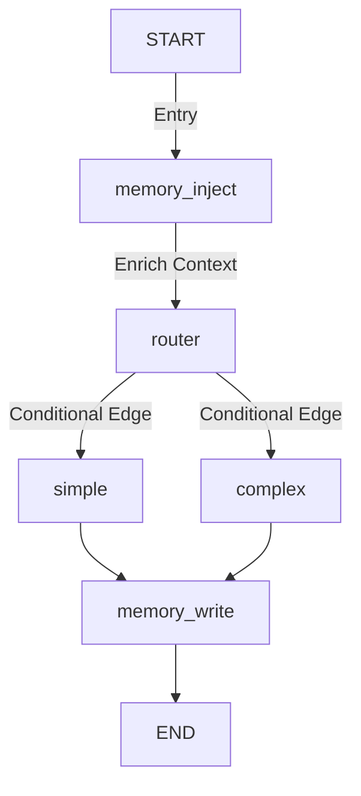

# Architecture Overview

Owlynn is a local-first autonomous agent built with **LangGraph** for orchestration and **FastAPI** for the backend, serving a single-page frontend. It is optimized for local inference (e.g., on Apple Silicon).

## Core Components

### 1. Orchestrator (LangGraph)
The core logic resides in `src/agent/graph.py`. It uses a stateful, cyclic graph with two primary paths optimized for speed and capability.

#### Execution Flow

*   **`memory_inject`**: Loads short-term and long-term context prior to reasoning.
*   **`router`**: Uses logic or a smaller model to determine if the query is **Simple** or **Complex**.
*   **`simple`**: Handles quick questions, chit-chat, or direct answers.
*   **`complex`**: Handles multi-step reasoning, coding tasks, and **tool execution** using a larger model.
*   **`memory_write`**: Persists new facts and updates state.

### 2. Dual-LLM Architecture (`src/agent/llm.py`)
Owlynn optimizes local inference performance by routing queries between two distinct models:

*   **Small Model (`nvidia/nemotron-3-nano-4b`)**:
    *   **Role**: Handles routing decisions (`router` node) and quick answers (`simple` node).
    *   **Benefit**: Extremely low latency, minimal memory footprint.
*   **Large Model (`qwen/qwen3.5-9b`)**:
    *   **Role**: Deep reasoning, complex instructions, and has tools bound for execution (`complex` node).
    *   **Benefit**: Advanced capability for analytical tasks.

### 3. State Management (`src/agent/state.py`)
The `AgentState` manages the conversation lifecycle:
*   `messages`: Conversation history.
*   `extracted_facts`: New facts learned during the turn.
*   `long_term_context`: Retrieved from VectorDB.
*   `route`: Target path ('simple' or 'complex').
*   `selected_tool` / `tool_result`: Tracks tool usage.

### 4. Backend API (`src/api/server.py`)
A **FastAPI** server exposes REST endpoints and a WebSocket handler for real-time interaction.

*   **WebSocket (`/ws/chat/{thread_id}`)**: Handles streaming responses from the LangGraph execution.
*   **File Management**: Operations (`/api/files`, `/api/upload`) tied to the sandboxed workspace.
*   **Settings**: Modular tabs for Profile, System Prompts, Memory Toggle, and Inference parameters.
*   **Personal Assistant**: Endpoints for topics, interests, and conversation summarization.

### 5. Memory System
*   **Short-term**: `RedisSaver` for fast session checkpoints.
*   **Long-term**: ChromaDB + Mem0 for cross-thread semantic retrieval (Facts, Preferences).
*   **Data files**: Lightweight JSON storage (`data/`) for topics, interests, and history.

---
*For guides on specific features, refer to the [guides/](../docs/guides) directory.*
